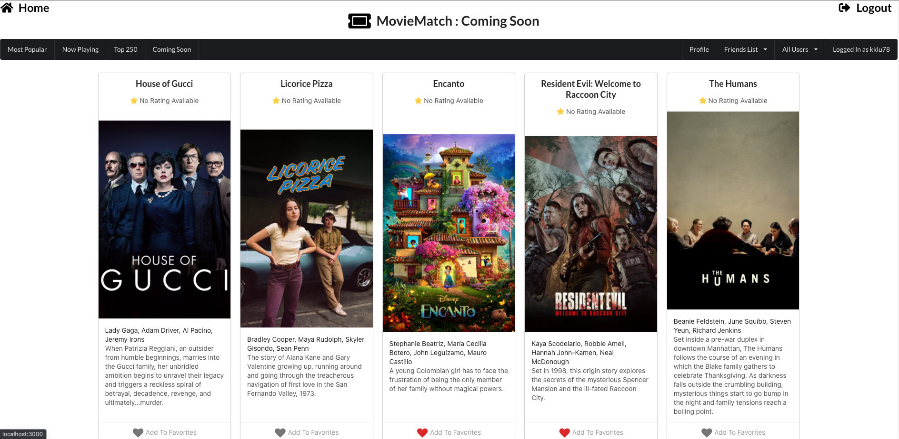

# MovieMatch (Find Movies To Watch With Your Friends)
---
## Table of Contents

* [About the Project](#about-the-project)
* [Technologies Used](#technologies-used)
* [Getting Started](#getting-started)
* [Next Steps](#next-steps)

# About The Project
MovieMatch is a movie browsing app that utilizes data from an IMDB API.  It allows users to create and account and add movies they like or would like to watch to their list.  Other users can then view their profile and see which movies they share an interest in.

Sign Up and Login

Search Queries

Movie Details Page

User Profiles

Friend Functions

# Technologies Used

* Javascript for interactive functions
* CSS for Styling
* React
* MongoDB
* Express
* Mongoose
* Node.js

# Getting Started

* [Click to launch the app](https://moviematch-app.herokuapp.com/)
    * See the live application here

* [Trello Board - Project Planning](https://trello.com/b/ntcckX7F)
    * This Trello Board was used to do all project planning and includes:
        * ERD
        * Project To Do List
        * Wireframe
        * Ice Box 

# Next Steps
* More privacy settings between users
* Unfriend functionality
* More Search Functionality
* Oauth Authentication
* Visit actor pages

